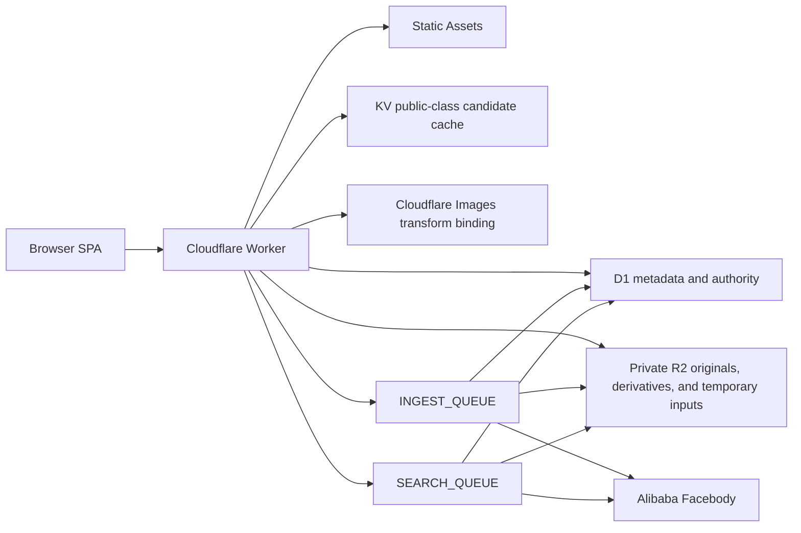

# Aryuki Photo

[中文文档](README_zh.md)

Aryuki Photo is a Cloudflare-native photo distribution application for classes,
events, and face-assisted photo discovery. It combines Google-inspired class
search, Alibaba Cloud Facebody matching, pointer-based saving, quota-aware
ownership, expiring share links, per-user home backgrounds, and an
administrator console.

Production origin: `https://distribute.aryuki.com`

This document describes the code currently present in this repository,
including the queue-generated `originals / previews / thumbnails` delivery
model and its upload-usage administration.

## Product principles

- A **class** is the logical photo collection. Chinese UI and documentation
  consistently use “类”.
- D1 is the authority for identity, permissions, visibility, ownership,
  storage accounting, references, shares, and job state.
- An original photo is stored once. Saving and sharing create references rather
  than copies.
- Every protected read is authorized by the Worker before an R2 object is
  returned.
- Long-running face, image-variant, save, deletion, and storage migration work
  is queue-driven and safe to retry.
- User identity, role assignment, and quota are bound to the stable Auth Center
  UUID, not to a display name or username.
- Desktop and mobile use the same design system, with dedicated responsive
  layouts for navigation, galleries, dialogs, camera controls, and admin pages.

## Application routes

| Route | Surface |
|---|---|
| `/home` | Google-inspired Aryuki home, public class search, camera entry, history, language, theme, and account controls |
| `/search?q=...` | Ranked public class results, expandable photo groups, selection, saving, preview, and download |
| `/selfie-recognition` | Desktop camera or mobile front-camera upload, queued face search, results, saving, and download |
| `/history` | A single reverse-chronological stream of class-search and selfie-search records |
| `/save/` | Owned classes, storage usage, class management, and Saved Photos grouped by class |
| `/share-link` | Create, inspect, edit, copy, disable, and delete share links |
| `/s/:slug` | Public share page with optional time window and password |
| `/account` | Identity, Auth Center binding, theme/background settings, and Bing daily background mode |
| `/admin` | System overview |
| `/admin/classes` | All classes, owners, counts, bytes, visibility, photo expansion, and force deletion |
| `/admin/uploads` | Upload usage by user, daily filtering, processing status, file bytes, and the Images processing switch; each user card keeps its four metrics and View action on one row |
| `/admin/users` | Users, stable identity, role assignment, effective permission, and usage |
| `/admin/roles` | Role CRUD, default role, access mode, and quota |
| `/admin/audit` | Actions grouped by user, including target, UUID, optional IP display, country code, sensitivity, and in-place photo preview |

The root route redirects to `/home`. Static assets use SPA fallback, so direct
navigation to any client route is supported.

## Feature overview

### Home and class search

- Multicolor Aryuki wordmark and centered search interaction inspired by the
  public Google home layout.
- Only `public` classes are discoverable from the home search box.
- Recent searches close when the user clicks outside the search surface.
- On submission, the wordmark and search box transition into the compact result
  header. Result scrolling keeps only the top header visible.
- Search, storage, history, and result galleries request thumbnail URLs. The
  lightbox also starts with the thumbnail; its **View original** action upgrades
  only the image area to the preview asset, while download requests the original.

Supported search syntax:

```text
"graduation day"     exact phrase
-draft               exclude a term
spring OR summer     match either group
class:photography    explicit class-name term
name:"Class 2026"    explicit class-name phrase
before:2026-07-01    classes created before this date
after:2026-01-01     classes created on or after this date
```

Input is limited to 160 characters, Unicode NFKC-normalized, and ranked by exact
match, prefix, substring, word, and word-prefix relevance. `name:` and `class:`
are aliases because the only searchable field is the class name.

### Face-assisted discovery

- Desktop uses `getUserMedia` and prefers the front-facing camera.
- Mobile retains a `capture="user"` file-input fallback.
- The former moving scan line and oval outline are not used.
- The uploaded selfie becomes a `search_tasks` record and is processed by
  `SEARCH_QUEUE`; the user may leave after the request is accepted.
- Matches are resolved from Alibaba Facebody entity IDs back to D1 photo rows
  and are filtered again through current read permissions.
- The UI does not present a confidence percentage as a user-facing guarantee.
- Selfie and class-search history are merged, labeled by type, sorted by time,
  and expandable into thumbnail grids.

### Galleries and dialogs

- Filenames are not rendered below gallery thumbnails.
- Clicking a thumbnail opens the shared full-screen lightbox without navigating
  away. It starts with the thumbnail, upgrades to the preview on demand, and
  reserves the original for download.
- When available, the lightbox shows image size, dimensions, camera, capture
  time, exposure, aperture, ISO, and focal length.
- Downloading or saving more than five photos requires confirmation.
- Every deletion requires a destructive confirmation.
- Risky share duration or content volume uses a destructive warning.
- Dialogs lock background scrolling. Desktop dialogs are centered; mobile
  confirmations use a bottom sheet that remains closable within the viewport.
- Upload progress appears in the lower-right corner and can collapse to a
  floating circular control.

### Language, theme, and backgrounds

- Chinese and English are supported by `public/i18n.js`.
- Language and theme controls remain available in the shared header.
- Both light and dark themes account for custom image backgrounds.
- Background settings are per user and live on `/account`.
- A custom background keeps an original plus a 16:9 cropped image.
- Deleting a custom background creates a 30-minute restore window.
- Bing mode proxies the current Bing home image from
  `https://www.bing.com/HPImageArchive.aspx`; it does not persist that image to
  R2.
- The selected home background covers the header, main area, and footer without
  applying the former global blur.

## System architecture



### Runtime responsibilities

| Component | Responsibility |
|---|---|
| Browser SPA | Routing, localized UI, camera/file input, selection, progress, dialogs, and polling |
| Worker fetch handler | Session validation, authorization, APIs, R2 streaming, static security headers, and queue production |
| Worker queue handler | Face ingestion/search, preview/thumbnail generation, pointer saves, audit writes, deletion, ownership transfer, and R2 rekey jobs |
| D1 | All durable metadata and authorization state |
| R2 | Original photos, generated previews/thumbnails, temporary selfies, and custom background files |
| KV | Five-minute cache of public class candidate IDs, names, and creation times |
| Images binding | Queue-driven WebP preview and thumbnail generation |
| Alibaba Facebody | Face entity index and similarity search |
| Cron | Five-minute recovery, retry enqueueing, and expired-data cleanup |

Cloudflare Vectorize is intentionally not bound. `photos.vector_id` stores the
Alibaba Facebody entity ID for compatibility.

## Identity and sessions

Aryuki Auth Center is the external identity provider. The Worker verifies the
returned token and stores only stable claims and its own opaque session:

- `auth_uuid` is the durable identity key and is unique.
- `auth_user_id`, `username`, display `name`, email, and avatar are profile
  fields that may be refreshed at login.
- Username is the primary label in the UI; display name or email may be shown
  as secondary information.
- Email is shown on `/account` only when Auth Center returns one.
- Non-admin users receive a link to
  `https://accounts.aryuki.com/<auth_uuid>`.
- Auth Center bearer tokens are never persisted.
- Normal application sessions last 14 days.
- Verified test sessions scoped to `picture-distributor` last 30 minutes.
- A login callback must pass state validation except for a verified,
  app-scoped test callback.

Temporary users receive a local session and may use public search, selfie
recognition, and history. Uploading, saving, sharing, and background management
require a bound Auth Center identity. Binding a temporary user transfers that
user's history to the stable account.

Administrator access is separate from the configurable role:

- `ADMIN_AUTH_UUIDS` contains comma-separated, verified Auth Center UUIDs.
- An existing database administrator with the same stable UUID remains an
  administrator.
- Display names and usernames never grant administrator access.

## Roles, permissions, and quota

Exactly one role is the default. New bound users receive it automatically.

| Access mode | Read scope | Write scope | Storage UI |
|---|---|---|---|
| `all_read` | All classes | None | Shown |
| `all_write` | All classes | Create and modify any class/photo | Shown |
| `own_write` | Public, owned, and saved content | Create classes; modify owned classes/photos | Shown |
| `own_read` | Public and saved content | None; may save accessible content | Hidden |

Administrator status overrides the role to effective `all_write` and adds role,
user, audit, rekey, and force-delete controls.

Quota uses decimal gigabytes:

```text
1 GB = 1,000,000,000 bytes
```

- `roles.quota_bytes` is the limit.
- `app_users.storage_used_bytes` is the maintained usage.
- A quota of `0` means unlimited.
- New SHA-256 assets charge the physical owner for the original, preview, and
  thumbnail bytes actually stored. Historical rows retain their legacy
  accounting until they are explicitly migrated.
- Saved pointers, share references, selfie inputs, and Bing backgrounds do not
  count as duplicated photo storage.
- Upload reservation is atomic in D1 and fails before storage is committed when
  it would exceed the current role quota.
- Ownership transfer may temporarily place the receiving user over quota to
  prevent saved content from disappearing. Further uploads remain blocked until
  usage is reduced or the role quota is raised.

## Classes, photos, and visibility

`photo_classes` is the collection model; `photos` belongs to exactly one class
while active.

- `public`: searchable by class name and readable from public results.
- `private`: excluded from public search. It remains available to administrators,
  `all_read`/`all_write` users, its owner, users who saved it, and valid shares.
- Legacy `is_open` remains during migration: `1` maps to `public`, `0` to
  `private`. Current writes keep both fields aligned.
- Class visibility updates are local SPA state updates and do not require a full
  page reload.

Uploads accept at most 100 photos per request. Standard photos are limited to
25 MiB each; Apple ProRAW DNG files are limited to 90 MiB each. The Worker
checks the byte signature instead of trusting the filename or declared MIME
type. JPEG, PNG, WebP, GIF, AVIF, HEIC, HEIF, and Apple ProRAW DNG are accepted;
active SVG input is rejected. A DNG upload must contain the display-ready JPEG
preview written by Apple Camera.

`photos.original_name` and the upload log use the browser-provided `File.name`.
This normally preserves the filename exposed by the device photo picker. A
browser may replace or synthesize that name for privacy; web code cannot read a
different internal album title when it is not provided.

Metadata extraction reads at most the first 512 KiB:

- JPEG: dimensions and selected EXIF values;
- PNG and GIF: dimensions;
- extended WebP: dimensions.

## IDs, content IDs, and R2 layout

New IDs have a typed lowercase prefix plus a 16-character base64url body
generated from 12 cryptographically secure random bytes:

```text
c_xdPr4EyB1q6YzZk9
p_e2P5CHFMf7pPM2y_
```

The random body is 96 bits. Common prefixes include `u_`, `c_`, `p_`, `task_`,
`hist_`, `bg_`, `save_`, `link_`, `role_`, `job_`, `audit_`, `up_`, and `ses_`.
`c_past000000000000` is the single fixed legacy migration exception.

Every upload accepted after migration `0008` receives a fixed content ID: the
lowercase 64-character hexadecimal SHA-256 digest of the untouched original
bytes. The same content ID is used in
all three stored filenames:

```text
p_or_<content-id>.<normalized-extension>
p_pr_<content-id>.webp
p_th_<content-id>.webp
```

New photo keys use the following private-R2 layout:

```text
originals/<class-id>/p_or_<content-id>.<normalized-extension>
previews/<class-id>/p_pr_<content-id>.webp
thumbnails/<class-id>/p_th_<content-id>.webp
temp/selfies/<task-id>.<normalized-extension>
backgrounds/<user-id>/<background-id>-original.<extension>
backgrounds/<user-id>/<background-id>-cropped.<extension>
```

`photo_assets` is authoritative for new physical object keys; `photos.r2_key`
remains authoritative for historical rows. Existing objects retain their
historical keys and filenames: migration `0008` neither renames nor moves them.
SHA-256 is a content identity and deduplication key, not an authorization
decision.

The first upload of a SHA-256 asset keeps the existing R2 directory convention
and stores all three objects below that first class ID. A later byte-identical
upload creates a new logical `photos` row in the requested class but points to
the existing `photo_assets` row. It therefore appears independently in My
Classes and All/Managed Classes while the physical R2 object remains under the
first class folder. Every image route authorizes the logical photo/class/share
before resolving the physical asset key.

## Three-tier image processing and delivery

This is the implemented behavior as of this repository state:

1. The upload request validates the image, hashes the complete untouched bytes
   with SHA-256, and atomically claims or reuses a `photo_assets` row.
2. It always writes one `photo_upload_records` row with uploader snapshots,
   filenames, keys, original bytes, total bytes, time, and processing state.
   Original naming is always `p_or_<sha256>.<extension>`, even when Images
   processing is disabled.
3. When Images processing is enabled, `photo.variants` is sent to
   `INGEST_QUEUE`. The consumer creates a width-1600 quality-84 WebP preview and
   a width-520 quality-74 WebP thumbnail. For ProRAW, the untouched DNG remains
   the original while its embedded JPEG preview is used for variants and face
   indexing.
4. Images queue state is `queued`, `processing`, `completed`, `decline`, or `error`.
   Disabling processing makes new records `decline`; transform failures become
   `error`. Facial recognition has its own state and error detail. The admin UI
   reports failures as `Images error` or `Facial recognition error`.
5. `/api/photos/:id/thumbnail` and `/api/photos/:id/preview` authorize the
   current request before an internal Edge Cache lookup. The outward response
   is always `private, no-store`.
6. Edge Cache contains only derivative bytes, never a user/session decision.
   A cached derivative cannot bypass a later permission or visibility check.
7. If a derivative is unavailable, a ProRAW request returns its embedded JPEG;
   other formats return the authorized original. `/api/photos/:id/file` always
   returns the untouched original and supports byte ranges.
8. Public-share thumbnails repeat the active-link, password-session, owner, and
   selected-content checks before the same private derivative path is used.
9. A duplicate upload is displayed as `deduplicated`, has `occupied_bytes=0`,
   and is annotated as adding no storage. The upload record still reports the
   original and total asset size for auditing.
10. Physical deletion removes original, preview, and thumbnail objects.
   Pointer-based ownership transfer retains all three because the photo remains
   valid.

Existing photos are backfilled into the upload log as `decline` without moving
their R2 objects or claiming a transformation. They continue to use the
authorized-original fallback. A future bounded backfill may generate their
derivatives, but it must not change any read, save, edit, or share permission.

For new SHA-256 assets, original and generated derivative bytes participate in
the physical owner's role quota and `storage_used_bytes`. Deduplicated logical
photos consume no additional bytes.

### Deduplication is not Save to mine

These are deliberately separate chains:

- upload deduplication creates another logical photo in another class while
  reusing one physical asset;
- Save to mine creates `saved_classes` or `saved_photos` pointers in a user's
  library and does not create another uploaded photo;
- deduplication ownership promotion is ordered by upload records; saved-content
  ownership protection is ordered by save pointers. Neither table substitutes
  for the other.

When the physical source photo is normally deleted and another logical upload
still references the asset, the earliest valid upload record becomes the
physical owner. Its state changes from `deduplicated` to `completed`, its
`occupied_bytes` becomes the asset total, and the former owner is released.
The R2 key is unchanged. Administrator force deletion is the explicit exception:
it removes the asset and every logical reference regardless of either chain.

## Save pointers and deletion semantics

`saved_classes` and `saved_photos` reference the single stored original.
Creating a save is queued as `pointer.save` and returns HTTP `202`.

The following invariants protect saved content:

1. Saving does not copy an R2 object or increase charged usage.
2. A non-owner removal deletes only that user's pointer.
3. A normal owner deletion soft-hides the target and creates one active,
   idempotent `deletion_jobs` row.
4. The queue consumer re-reads the job and verifies
   `expected_owner_user_id`.
5. If valid pointers exist, the earliest pointer by `(created_at, user_id)`
   becomes the owner and receives the charged bytes.
6. If a class is deleted but an individual photo pointer preserves a photo,
   `class_removed_at` detaches it from the former class, search, and class-based
   shares while keeping the standalone photo.
7. If no valid pointer exists, the consumer removes the Alibaba entity, R2
   object, D1 row, and charged bytes.
8. History and share references do not preserve ownership.
9. Administrator force deletion ignores pointers and physically removes the
   target. Read paths tolerate missing rows and objects.

Job state is `pending -> processing -> completed|failed`. Only one active job
may exist for a `(kind, target_id)` pair, so duplicate queue delivery is safe.

## Share links

A share link may include whole-class references, individual-photo references,
or both. It never copies image bytes.

- Custom suffix: 3-64 lowercase letters, numbers, hyphens, or underscores.
- Optional start and end timestamps.
- `active` or `disabled` status.
- Maximum selection: 500 classes and 1,000 photos.
- A class selection dynamically includes its currently available photos.
- A deleted or detached item becomes unavailable without rewriting every share.

Passwords:

- Minimum length is six characters.
- Verification uses a random salt and a keyed one-way hash.
- Owner-only password display uses separately encrypted ciphertext.
- `SHARE_PASSWORD_KEY` is required to create, verify, decrypt, or edit a
  password-protected share.
- Unlock attempts are limited to five per ten minutes per network/share key.
- The share session token is stored only as a hash and lasts at most 12 hours,
  capped by the share end time.

## Queues, recovery, and retention

`INGEST_QUEUE` message types:

- `photo.ingest`
- `photo.variants`
- `face.delete`
- `storage.delete`
- `storage.rekey`
- `pointer.save`
- `audit.write`

`SEARCH_QUEUE` handles `search.run`.

Consumers use a batch size of one, three Cloudflare retries, exponential retry
delay from the Worker, and configured dead-letter queues. D1 job rows remain
the durable source of truth.

Every five minutes Cron:

- returns indexing, image-processing, search, or deletion claims stale for 15
  minutes to a retryable state;
- re-enqueues pending jobs;
- removes completed/failed selfie inputs after 24 hours, with a seven-day hard
  limit;
- retains temporary-user search history for seven days;
- retains bound-user search and selfie history for 90 days;
- removes expired application/share sessions and rate-limit buckets;
- permanently removes background files after the 30-minute restore window;
- removes inactive temporary users after 30 days when no referenced data
  remains.

Setting `RETRY_FAILED_JOBS=true` also includes failed deletion jobs in Cron
re-enqueueing.

## Administration and audit

The administrator console provides:

- total and active classes, photos, users, bytes, active shares, and pending
  jobs;
- every class with owner, photo count, byte size, visibility, and expandable
  photos;
- user-to-role assignment and effective quota/usage;
- role creation, editing, deletion, ordering, and default-role selection;
- upload usage grouped by uploader, with day-accurate date filtering, overall
  totals, original/derivative/occupied bytes, filenames, detailed Images and
  facial-recognition errors, and `deduplicated` promotion state; each uploader
  card keeps total uploads, processed count, reused count, occupied bytes, and
  the View action in one responsive row;
- an administrator-only Images processing switch; disabling it records new
  uploads as `decline`, while failures are retained as `error`;
- failed face-ingest retry;
- resumable legacy R2 rekeying;
- force deletion of a class or photo;
- audit records grouped by user; IP addresses are hidden until the administrator
  enables the display switch, and live photo targets open in the shared
  full-screen lightbox while `/admin/audit` remains active.

Audit writes are queued after successful auditable requests. A record contains
the local user ID, stable Auth Center UUID, action, IP, two-letter country code,
sensitivity flag, target kind/ID/name/count, and timestamp. Destructive and
other sensitive actions are visually highlighted. Long UUIDs, IPs, and target
names may be truncated on small screens but remain copyable in full.

## D1 data model

| Table | Purpose |
|---|---|
| `roles` | Access mode, quota, default/system flags, and display ordering |
| `app_users` | Stable Auth Center binding, profile, role, administrator flag, and charged usage |
| `app_sessions` | Opaque application sessions |
| `photo_classes` | Class name, description, owner, visibility, and deletion state |
| `photo_assets` | SHA-256 physical identity, unchanged R2 keys, physical owner, byte totals, variant and facial-processing state |
| `photos` | Logical class membership, owner, optional asset reference, display metadata, indexing, and deletion state |
| `photo_upload_records` | Upload/uploader snapshots, content ID, three object keys, total/occupied bytes, deduplication flag, timestamps, and Images/facial states |
| `image_processing_settings` | Singleton administrator-controlled Images processing switch |
| `saved_classes` | User-to-class save pointers |
| `saved_photos` | User-to-photo save pointers |
| `deletion_jobs` | Idempotent delete and rekey work |
| `search_tasks` | Selfie inputs, status, ordered matches, and scores |
| `class_search_history` | Query text and referenced result IDs |
| `share_links` | Owner, suffix, time window, password material, and status |
| `share_link_classes` | Share-to-class references |
| `share_link_photos` | Share-to-photo references |
| `share_sessions` | Hashed temporary unlock sessions |
| `user_backgrounds` | Mode, original/cropped keys, and restore state |
| `audit_logs` | Actor, network, action, sensitivity, and target |
| `rate_limit_buckets` | D1-backed fixed-window request counters |

Legacy compatibility columns such as `role`, `is_open`, `size_bytes`, and
`matched_urls` remain until every deployed version stops reading them.

## API summary

### Authentication

```text
GET  /api/me
GET  /api/auth/login-url
POST /api/auth/temp
POST /api/logout
GET  /sso-callback[/<mode>]
```

### Classes, photos, and search

```text
GET|POST          /api/classes
GET|PATCH|DELETE  /api/classes/:id
GET|POST          /api/classes/:id/photos
GET                /api/class-search
GET|POST           /api/class-search-history
POST               /api/search
GET                /api/status/:taskId
GET                /api/history
DELETE             /api/history/:type/:id
GET                /api/selfies/:taskId/file
GET                /api/photos/:id/thumbnail
GET                /api/photos/:id/preview
GET                /api/photos/:id/file
DELETE             /api/photos/:id
```

### Storage, backgrounds, and saves

```text
GET         /api/storage
GET         /api/saved
POST|DELETE /api/saved/classes/:id
POST|DELETE /api/saved/photos/:id
GET|POST|DELETE /api/background
POST        /api/background/mode
POST        /api/background/restore
GET         /api/background/file
GET         /api/background/bing
```

### Shares

```text
GET|POST           /api/share-links
GET|PATCH|DELETE   /api/share-links/:id
GET                /api/public/shares/:slug
POST               /api/public/shares/:slug/unlock
GET                /api/public/shares/:slug/photos/:photoId/file
GET                /api/public/shares/:slug/photos/:photoId/preview
GET                /api/public/shares/:slug/photos/:photoId/thumbnail
```

### Administration

```text
GET          /api/admin/overview
GET          /api/admin/uploads
GET          /api/admin/uploads/records
GET|PATCH    /api/admin/image-processing
GET          /api/admin/classes
GET          /api/admin/users
PATCH        /api/admin/users/:id
GET|POST     /api/admin/roles
PATCH|DELETE /api/admin/roles/:id
GET          /api/admin/audit
POST         /api/admin/retry-ingest
DELETE       /api/admin/classes/:id
DELETE       /api/admin/photos/:id
POST         /api/admin/storage/rekey
GET          /api/admin/storage/rekey/status
```

The legacy `POST /api/admin/photos` and `/api/query-history` routes remain for
compatibility.

## Repository layout

```text
public/
  index.html          SPA shell
  app.js              route rendering and interaction
  client.js           API client, timeouts, and upload progress
  i18n.js             Chinese/English translation layer
  search-syntax.js    browser-side query parser
  styles.css          tokens, responsive layouts, dialogs, galleries
worker/
  index.js            fetch, API, queue, Cron, authorization, storage
  lib/
    alibaba.js        Facebody integration
    dng.js            ProRAW/DNG detection and embedded-JPEG extraction
    ids.js            96-bit typed IDs
    image-metadata.js safe header/EXIF extraction
    passwords.js      share password hash/encryption
    search-query.js   authoritative query parser and ranking
migrations/           additive upgrades for an existing database
schema.sql            complete fresh-install D1 schema
design-research/      reference and visual QA screenshots
wrangler.toml         Worker routes, bindings, queues, and Cron
```

Local output, tests, Playwright reports/results, temporary directories,
build/deployment caches, environment files, credentials, and secret files or
directories are ignored by `.gitignore`.

## Cloudflare bindings and configuration

`wrangler.toml` defines:

| Binding | Service |
|---|---|
| `ASSETS` | Static SPA assets |
| `DB` | D1 database |
| `PHOTO_BUCKET` | Private R2 bucket |
| `SEARCH_CACHE` | KV public-class candidate cache |
| `IMAGES` | Image transform binding |
| `INGEST_QUEUE` | Ingest/deletion/save/audit queue |
| `SEARCH_QUEUE` | Face-search queue |

The configuration also declares a custom domain, a five-minute Cron trigger,
and one dead-letter queue for each production queue.

Non-secret variables include the public origin, Auth Center origin/application
ID, administrator UUID allowlist, Alibaba endpoint/region/database/API version,
and face matching limits.

Required production secrets:

```bash
npx wrangler secret put ALIBABA_ACCESS_KEY_ID
npx wrangler secret put ALIBABA_ACCESS_KEY_SECRET
npx wrangler secret put SHARE_PASSWORD_KEY
```

Use a high-entropy independent value for `SHARE_PASSWORD_KEY`. Never place
Auth Center test-login secrets, Cloudflare credentials, API keys, resource
exports, `.dev.vars`, or local secret files in source, frontend code, logs, or
documentation.

## Local development

Requirements:

- Node.js 22.5 or newer;
- npm;
- a Cloudflare account and Wrangler login for remote resource/deploy work.

Install dependencies:

```bash
npm ci
```

For local-only development, place secret values in an ignored `.dev.vars` file
using names only, never committed values:

```text
ALIBABA_ACCESS_KEY_ID=...
ALIBABA_ACCESS_KEY_SECRET=...
SHARE_PASSWORD_KEY=...
```

Create the local D1 schema and start the Worker:

```bash
npx wrangler d1 execute picture-distributor-db --local --file=schema.sql
npm run dev
```

Local Cloudflare state is kept under `.wrangler/` and is ignored.

## Fresh database and migrations

### Fresh database

Apply only the complete schema:

```bash
npx wrangler d1 execute picture-distributor-db --remote --file=schema.sql
```

Do not replay legacy migrations into a fresh database.

### Existing database

Export a backup and inspect remote migration state before any write:

```bash
npx wrangler d1 migrations list picture-distributor-db --remote
npx wrangler d1 export picture-distributor-db --remote --output=backup-before-migration.sql
```

Pause uploads, deploy compatible code in the intended order, and then apply
additive migrations:

```bash
npx wrangler d1 migrations apply picture-distributor-db --remote
```

Migration history:

| Migration | Change |
|---|---|
| `0001_product_model.sql` | Roles, quotas, ownership, visibility, save pointers, shares, deletion/rekey jobs, score storage, and indexes |
| `0002_legacy_photos_to_past.sql` | Moves ownerless legacy photos into private `past`, assigns the earliest administrator, recalculates usage, and leaves R2 keys unchanged |
| `0003_own_read_backgrounds.sql` | Adds class descriptions and the initial custom-background/restore table |
| `0004_background_share_audit.sql` | Adds background mode, encrypted share-password display material, and audit logs |
| `0005_photo_metadata_audit_targets_email.sql` | Adds email, photo metadata, and audit target details |
| `0006_image_variants_upload_records.sql` | Adds the Images switch and upload/variant usage records; legacy photos are logged as `decline` without moving objects |
| `0007_anonymous_local_history.sql` | Keeps anonymous history client-side and makes server search ownership nullable for cleanup |
| `0008_sha256_photo_assets.sql` | Adds SHA-256 physical assets, logical-photo references, occupied-byte accounting, deduplication state, and separate facial status without changing old names or R2 keys |
| `0009_photo_asset_concurrency.sql` | Prevents two concurrent byte-identical requests from creating duplicate active photos in the same class |

Important upgrade check: the fresh schema supports `own_read`. An existing
database originally created by migration `0001` may still have the older
three-value `roles.access_mode` check because migration `0003` does not rebuild
that table. Inspect `sqlite_schema` before assigning `own_read` and add a
reviewed table-rebuild migration if the old constraint is present.

Legacy photo migration uses fixed class ID `c_past000000000000`, makes it
private, assigns the earliest administrator as owner, and does not move R2
objects. Empty legacy classes are soft-deleted for audit.

After the metadata migration, an administrator can start resumable object-key
normalization:

```text
POST /api/admin/storage/rekey
GET  /api/admin/storage/rekey/status
```

Each `rekey_photo` job copies to the canonical key, updates D1, and only then
deletes the old object.

## Tests and deployment

Run syntax checks and the local suite:

```bash
npm run check
```

The `node:test` suite currently covers:

- typed 96-bit IDs;
- deterministic lowercase SHA-256 photo content IDs and asset references;
- server and browser search syntax;
- English translations and dynamic counts;
- image metadata signatures;
- keyed share-password verification and owner-only encryption;
- fresh schema/default role behavior;
- legacy `past` and upload-record migrations;
- Wrangler assets, KV, recovery, DLQ, and no-Vectorize configuration;
- optional numeric parameter defaults;
- raster signature validation and SVG rejection;
- Unicode content disposition;
- app-scoped verified test callbacks.

Perform a deployment preflight and deploy:

```bash
npm run deploy:check
npx wrangler deploy
```

After deployment:

1. verify the live asset version and `/api/me`;
2. use a newly generated, app-scoped Auth Center test login without recording
   its secret;
3. check Chinese and English on desktop and mobile;
4. test public/private search, face search, history expansion, original
   lightbox, save queue, upload queue, share password, account background,
   storage quota, and administrator audit;
5. confirm there is no horizontal page scroll and dialogs lock the underlying
   page;
6. inspect queue failures and both dead-letter queues.

## Security and operational invariants

- Mutating requests must be same-origin.
- Sessions, share unlock tokens, and restore tokens use secure, HttpOnly or
  hashed handling as appropriate.
- Protected objects are never exposed through a public R2 URL.
- Permissions are re-evaluated from D1 on every protected read.
- KV contains no authorization truth.
- Raster signatures are validated; SVG and mismatched declared types are
  rejected.
- File responses use safe Unicode `Content-Disposition`, `nosniff`, sandboxed
  CSP, same-origin resource policy, and byte-range support.
- Static responses set CSP, frame denial, referrer, permissions, and
  content-type protection headers.
- Queue messages carry stable IDs; consumers re-read D1 before destructive
  work.
- Storage accounting changes with ownership, not with display name, username,
  save count, or share count.
- Never commit real secrets or paste them into issues, README files, frontend
  code, screenshots, or command transcripts.

## Visual references

`design-research/google-home-2026-07-27.png` records the public Google home
layout used for spacing and interaction study. Aryuki Photo uses its own mark,
content, navigation, and product behavior.

The remaining `design-research/qa-*.png` files record desktop, mobile, dark,
English, search-transition, selfie, history, and administrator checks. They are
QA evidence, not runtime dependencies.
