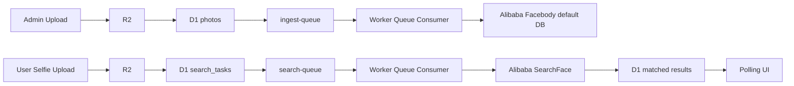

# PhotoFinder / Picture Distributor

PhotoFinder is a Cloudflare-first photo distribution system for event photography. It supports:

- Admin upload and class-based photo management
- Asynchronous ingestion with Cloudflare Queues
- Face indexing and face search with Alibaba Cloud Facebody
- Public or private class visibility control
- Temporary guest users, Auth Center binding, and admin login
- Search history for bound users
- Full-size image preview, selection, direct download, and ZIP download

The current production domain is:

- `https://distribute.aryuki.com`

## 1. High-Level Architecture

The project uses a decoupled upload/search pipeline:



Core services:

- Cloudflare Workers: API gateway + queue consumers
- Cloudflare D1: metadata, auth sessions, classes, task history
- Cloudflare R2: original photos and selfie uploads
- Cloudflare Queues: ingestion and search task scheduling
- Alibaba Facebody: face indexing and search
- Aryuki Auth Center: admin login and user binding

## 2. Important Current Reality

There is one architectural detail worth calling out very clearly:

- `wrangler.toml` still contains a `Vectorize` binding.
- The current production implementation does **not** use Cloudflare Vectorize for live similarity search.
- Production search currently uses Alibaba Facebody `AddFace` / `SearchFace`, then maps matched `EntityId` values back to D1 records.

In other words:

- Face indexing is currently stored in Alibaba Facebody `default` database.
- D1 stores the Alibaba `EntityId` in `photos.vector_id`.
- Search results are filtered by score/confidence thresholds before D1 lookup.

This is intentional in the current codebase, but future refactors should either:

1. fully adopt Vectorize and remove the Alibaba search dependency, or
2. keep Alibaba as the source of truth and document Vectorize as reserved / unused.

## 3. Main User Flows

### 3.1 Admin Flow

Admin users can:

- log in through Aryuki Auth Center
- create classes
- open or close classes for search visibility
- upload one or many photos into a selected class
- monitor upload progress in a floating upload status box
- view class thumbnails
- delete a single photo
- delete an entire class and all its photos
- requeue failed ingestion tasks

### 3.2 Guest / User Flow

Users can:

- enter with a temporary account
- upload or capture a selfie
- submit a face search task
- poll for results
- preview full-size images
- select results
- download selected originals directly
- download selected results as ZIP

### 3.3 Bound User / Admin History

Users who are bound to Aryuki Auth Center, plus admins, can:

- open the History panel
- see when a search was run
- see which selfie was used
- see which photos were matched
- directly download historical matches

Temporary users do not have access to history until they bind an Auth Center account.

## 4. Repository Layout

Main files:

- [wrangler.toml](/D:/Code/picture-distributor/wrangler.toml): Cloudflare Worker configuration
- [schema.sql](/D:/Code/picture-distributor/schema.sql): base D1 schema
- [migrate-auth-classes.sql](/D:/Code/picture-distributor/migrate-auth-classes.sql): earlier schema migration
- [migrate-search-history.sql](/D:/Code/picture-distributor/migrate-search-history.sql): search history migration
- [worker/index.js](/D:/Code/picture-distributor/worker/index.js): API routes + queue consumers
- [worker/homepage3.js](/D:/Code/picture-distributor/worker/homepage3.js): current inlined frontend
- [.gitignore](/D:/Code/picture-distributor/.gitignore): local ignore rules

Legacy / not actively used in production:

- `App.tsx`
- `api-worker.js`
- `consumer-worker.js`
- `worker/homepage2.js`

The currently served UI is rendered by:

- `worker/index.js` -> `renderHomePage()` from `worker/homepage3.js`

## 5. Cloudflare Configuration

### 5.1 Worker

Current Worker configuration:

- Worker name: `picture-distributor`
- Main entry: `worker/index.js`
- Custom domain: `distribute.aryuki.com`

### 5.2 D1

- Database name: `picture-distributor-db`
- Database ID: `b54a3c30-327e-4e07-81bb-303caf1dff7f`

### 5.3 R2

- Bucket name: `picture-distributor-save`

### 5.4 Queues

- `ingest-queue`
- `search-queue`

### 5.5 Vectorize

- Index name: `picture-distributor-vector`
- Binding name: `PHOTO_VECTOR_INDEX`

Again: this binding exists, but current search does not depend on it.

## 6. Environment Variables

Current environment variables in [wrangler.toml](/D:/Code/picture-distributor/wrangler.toml):

| Variable | Purpose |
|---|---|
| `PUBLIC_APP_ORIGIN` | Public app origin |
| `PUBLIC_R2_BASE_URL` | Reserved public asset base URL |
| `APP_ID` | Auth Center sub-app ID |
| `AUTH_CENTER_ORIGIN` | Aryuki Auth Center origin |
| `ADMIN_USERNAMES` | Comma-separated allowed admin usernames |
| `VECTOR_DIMENSIONS` | Reserved Vectorize dimension setting |
| `VECTOR_TOP_K` | Reserved Vectorize search count |
| `VECTOR_MATCH_THRESHOLD` | Reserved Vectorize score threshold |
| `ALIBABA_ENDPOINT` | Alibaba Facebody endpoint |
| `ALIBABA_REGION_ID` | Alibaba region |
| `ALIBABA_DB_NAME` | Facebody DB name, currently `default` |
| `ALIBABA_API_VERSION` | Alibaba API version |
| `ALIBABA_SEARCH_LIMIT` | Max search candidates from Alibaba |
| `ALIBABA_SCORE_THRESHOLD` | Minimum Alibaba score for accepted match |
| `ALIBABA_CONFIDENCE_THRESHOLD` | Minimum Alibaba confidence for accepted match |
| `ALIBABA_MAX_FACES` | Maximum faces to inspect in a selfie |
| `ALIBABA_QUALITY_SCORE_THRESHOLD` | Minimum input image quality threshold |

Secrets are expected in Cloudflare, not in source:

- `ALIBABA_ACCESS_KEY_ID`
- `ALIBABA_ACCESS_KEY_SECRET`

## 7. Database Schema

### 7.1 `photos`

Stores uploaded event images.

Important columns:

- `id`
- `class_id`
- `r2_key`
- `original_name`
- `content_type`
- `size_bytes`
- `status`
- `vector_id`
- `indexed_at`
- `error_message`

`vector_id` is currently the Alibaba `EntityId`.

### 7.2 `photo_classes`

Stores logical event groups / albums.

Important columns:

- `id`
- `name`
- `is_open`
- `created_by`

`is_open = 1` means the class can be searched by non-admin users.

### 7.3 `search_tasks`

Stores selfie search requests and result history.

Important columns:

- `id`
- `user_id`
- `selfie_key`
- `selfie_name`
- `selfie_content_type`
- `selfie_size_bytes`
- `status`
- `match_count`
- `matched_photo_ids`
- `matched_urls`
- `error_message`
- `completed_at`

### 7.4 `app_users`

Stores local app users.

Kinds:

- `admin`
- `auth`
- `temp`

Roles:

- `admin`
- `user`

### 7.5 `app_sessions`

Stores session cookies for Worker-side login state.

## 8. API Surface

### Auth

- `GET /api/me`
- `GET /api/auth/login-url?mode=admin|bind`
- `POST /api/auth/temp`
- `POST /api/logout`
- `GET /sso-callback/admin`
- `GET /sso-callback/bind`

### Classes

- `GET /api/classes`
- `POST /api/classes`
- `PATCH /api/classes/:id`
- `DELETE /api/classes/:id`
- `GET /api/classes/:id/photos`

### Photos

- `POST /api/admin/photos`
- `DELETE /api/photos/:id`
- `GET /api/photos/:id/file`

### Search

- `POST /api/search`
- `GET /api/status/:taskId`
- `GET /api/history`

### Assets

- `GET /api/assets/:encodedKey`

## 9. Ingestion Flow

When admin uploads photos:

1. Files are uploaded to R2.
2. Worker inserts `photos` records with `status='uploaded'`.
3. Worker sends one queue message per photo to `ingest-queue`.
4. Queue consumer loads the image from R2.
5. Worker uploads the image to Alibaba temporary OSS using STS.
6. Worker calls `AddFaceEntity`.
7. Worker calls `AddFace`.
8. D1 photo status becomes `indexed` and `vector_id` is set.

If ingestion fails:

- `photos.status` becomes `failed`
- `photos.error_message` stores the error

## 10. Search Flow

When a user submits a selfie:

1. Selfie is uploaded to R2.
2. Worker inserts a `search_tasks` row.
3. Worker sends a message to `search-queue`.
4. Queue consumer uploads the selfie to Alibaba temporary OSS.
5. Worker calls `SearchFace`.
6. The response is filtered by:
   - score threshold
   - confidence threshold
   - face count limit
   - quality threshold
7. Matched Alibaba `EntityId` values are mapped back to D1 `photos.vector_id`.
8. Only photos from open classes are returned for non-admin search results.
9. Results are stored in `search_tasks`.

## 11. Frontend Behavior

The frontend is server-rendered HTML with inline JavaScript.

Key UI behavior:

- login page is the default entry
- admin panel is hidden for non-admin users
- search panel is always available after login
- temporary users can bind Auth Center later
- thumbnails use Cloudflare Image Resizing path first
- if thumbnail load fails, the image falls back to the original photo URL
- full-size preview uses original images
- preview arrows are SVG-based, rounded, and glass-style
- upload progress is shown with:
  - current filename
  - current step
  - progress bar
  - completed / total / remaining summary

## 12. Auth Model

### Admin Login

Admins log in via Aryuki Auth Center.

Only users matching `ADMIN_USERNAMES` are allowed to enter admin mode.

### Guest Login

Guests can enter with a locally created temporary profile:

- random normal American-style name
- local session cookie
- no history access by default

### Binding

Temporary users can bind with Auth Center later.

Once bound:

- `auth_uuid` is stored
- the user can access history
- the menu shows a link to the Auth Center user page

## 13. Deletion Semantics

### Delete Photo

Deleting a photo will:

1. remove the corresponding Alibaba face entity
2. remove the R2 object
3. remove the D1 row

### Delete Class

Deleting a class will:

1. iterate through all photos in the class
2. delete each photo’s Alibaba entity
3. delete each R2 object
4. delete each D1 photo row
5. delete the class row

The UI requires a confirmation dialog before destructive actions.

## 14. Search History

History is intentionally restricted.

Accessible only when:

- the current user is bound to Auth Center, or
- the current user is an admin with Auth Center identity

History includes:

- selfie thumbnail
- original selfie filename
- creation time
- task status
- matched photos
- direct download
- ZIP download

## 15. Thumbnail Strategy

The frontend uses:

- `/cdn-cgi/image/.../<absolute-url>`

for faster thumbnail display.

Because image resizing can fail for some origins or edge cases, every thumbnail also includes:

- `onerror` fallback to the original full image URL

This guarantees that the UI still renders even if resized delivery fails.

## 16. Deployment

Current deployment command:

```bash
npx wrangler deploy
```

Recommended D1 schema commands:

```bash
npx wrangler d1 execute picture-distributor-db --remote --file=schema.sql
npx wrangler d1 execute picture-distributor-db --remote --file=migrate-auth-classes.sql
npx wrangler d1 execute picture-distributor-db --remote --file=migrate-search-history.sql
```

If the database was already migrated in parts, rerunning a migration may fail on duplicate columns. In that case:

- inspect current schema first, or
- create a new idempotent migration for the remaining changes

## 17. Known Caveats

### 17.1 Vectorize Is Bound but Not Active

The codebase still exposes `PHOTO_VECTOR_INDEX`, but production search does not currently use it.

### 17.2 Worker HTML Frontend

The UI is embedded directly in `worker/homepage3.js`. This keeps deployment simple, but:

- the file is long
- UI logic, style, and markup are tightly coupled
- larger future UI changes may be easier in a proper React / Next build

### 17.3 Alibaba Input Constraints

Some photos may fail indexing because Alibaba rejects:

- low quality images
- oversized dimensions
- unsupported face content

Those failures are saved in `photos.error_message`.

### 17.4 Thumbnail Rendering Depends on Edge Features

If `/cdn-cgi/image` cannot generate a thumbnail for a specific image, the frontend falls back to the original image automatically.

## 18. Suggested Next Refactors

If you continue evolving the system, these are the highest-value next steps:

1. Move the frontend out of inline Worker HTML into a dedicated React/Next app.
2. Decide whether Vectorize should be fully adopted or fully removed.
3. Add dedicated thumbnail objects in R2 instead of relying only on edge resizing.
4. Add photo pagination for very large classes.
5. Add background cleanup for deleted search selfies.
6. Add structured audit logs for admin operations.

## 19. Quick Start Checklist

1. Configure secrets in Cloudflare.
2. Confirm D1, R2, Queues, and domain bindings in `wrangler.toml`.
3. Apply required D1 schema / migrations.
4. Deploy with `npx wrangler deploy`.
5. Test:
   - temp login
   - admin login
   - class creation
   - photo upload
   - ingestion success
   - face search
   - history for bound users
   - deletion flows

## 20. License / Ownership Note

This repository is tailored for the Aryuki / PhotoFinder deployment and contains environment-specific bindings, routes, and auth assumptions. Treat it as deployment-specific infrastructure, not a generic starter template.
