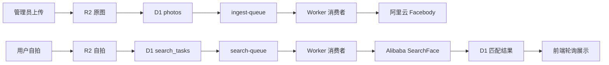

# PhotoFinder / Picture Distributor 项目说明

PhotoFinder 是一个基于 Cloudflare 的活动照片分发系统。当前生产域名：

- `https://distribute.aryuki.com`

## 主要功能

- 管理员创建、开放、关闭和删除照片类（Class）
- 管理员批量上传照片，Cloudflare Queue 异步建立人脸索引
- 使用阿里云 Facebody `AddFace` / `SearchFace` 进行人脸检索
- 临时用户、AuthCenter 账号绑定和管理员登录
- 桌面端调用浏览器摄像头，移动端调用前置摄像头拍摄自拍
- 只搜索已开放类的类名搜索页面 `/search`
- 原图预览、单张选择、整类选择、分别下载和 ZIP 下载
- 人脸搜索历史与类名查询历史
- 桌面端和移动端响应式页面，无横向溢出
- 图片、类和历史记录删除前使用自定义确认弹窗

## 系统架构



核心服务：

- Cloudflare Workers：页面、API 和队列消费者
- Cloudflare D1：照片元数据、类、会话和在线历史
- Cloudflare R2：原始照片和自拍文件
- Cloudflare Queues：上传索引和人脸查找任务
- 阿里云 Facebody：人脸索引和检索
- Aryuki AuthCenter：管理员登录和用户绑定

## 当前检索实现

`wrangler.toml` 仍保留 Vectorize 绑定，但生产环境的人脸检索实际使用阿里云 Facebody。

- `photos.vector_id` 保存阿里云 `EntityId`
- 搜索结果按阿里云返回的 Score、Confidence 和质量阈值过滤
- 前端不显示无法保证真实性的“相似度百分比”
- 普通用户只能获得已开放类中的结果

## 页面

### `/`

主页面包含：

- 管理员类与图片管理
- 自拍拍摄/上传和人脸查找
- 匹配结果预览、选择和下载
- 顶部常驻 History 按钮、紧凑类名搜索框和用户名

设备入口不读取浏览器 UA，而是根据指针、悬浮和触摸能力展示对应按钮：

- 桌面设备：浏览器摄像头实时预览与拍照
- 移动设备：`capture="user"` 调用前置摄像头

### `/search`

类名搜索仅查询 `is_open = 1` 的类，相关度顺序为：

1. 完全匹配
2. 名称开头匹配
3. 连续短语匹配
4. 全部关键词匹配
5. 部分关键词匹配

结果页展示类及其已建立索引的图片缩略图，支持：

- 选择整个类
- 选择部分图片
- 分别下载
- ZIP 下载
- 点击缩略图打开原图

### `/history`

用于展示类名查询历史。

绑定 AuthCenter 的用户和管理员：

- 记录在线写入 D1 并跨设备同步
- 保存查询时间、结果数量和当时匹配的原图 ID
- 历史只引用原图，不复制或额外保存图片文件
- 图片被删除、未建立索引，或者所属类被关闭/删除后，缩略图显示为不可点击的灰色占位

未绑定用户：

- 查询记录保存在一年有效期的 Cookie 中
- 只记录查询文字、时间和结果数量
- 不展示历史缩略图

两类用户都可以删除自己的历史记录。

## 响应式与交互

- 页面、图片、卡片和菜单均限制在当前视口内
- 手机端标题下方依次显示 History、紧凑搜索框和用户名
- 用户详情窗口限制最大高度，内容过长时内部滚动
- 点击用户详情窗口外任意位置会关闭窗口
- 图片选择仅更新选择按钮，不重新渲染缩略图列表
- 删除确认弹窗在桌面端居中显示
- 手机端删除确认弹窗位于底部并从下向上进入，四角均为圆角
- 打开确认弹窗时锁定底层页面滚动

## 删除语义

删除照片会：

1. 删除对应阿里云人脸实体
2. 删除 R2 原图
3. 删除 D1 照片记录

删除类会逐张清理类内照片，再删除类记录。图片、类和历史记录删除均需要在红色确认按钮的自定义弹窗中确认。

## 仓库结构

当前生产入口：

- `worker/index.js`：Worker 路由、API 和队列消费者
- `worker/homepage3.js`：主页面
- `worker/searchpage.js`：类名搜索结果页
- `worker/historypage.js`：类名查询历史页
- `wrangler.toml`：Cloudflare 配置与资源绑定
- `schema.sql`：完整 D1 表结构

数据库迁移：

- `migrate-auth-classes.sql`
- `migrate-search-history.sql`
- `migrate-class-search-history.sql`
- `migrate-class-search-results.sql`

以下文件是旧实现或草稿，不是当前生产入口：

- `App.tsx`
- `api-worker.js`
- `consumer-worker.js`
- `worker/homepage.js`
- `worker/homepage2.js`

## Cloudflare 资源

- Worker：`picture-distributor`
- D1：`picture-distributor-db`
- R2：`picture-distributor-save`
- Queue：`ingest-queue`
- Queue：`search-queue`
- Vectorize：`picture-distributor-vector`（当前人脸搜索未使用）

## 本地检查与部署

语法检查：

```bash
node --check worker/index.js
node --check worker/homepage3.js
node --check worker/searchpage.js
node --check worker/historypage.js
```

首次登录：

```bash
npx wrangler login
```

执行数据库迁移：

```bash
npx wrangler d1 execute picture-distributor-db --remote --file=migrate-class-search-history.sql
npx wrangler d1 execute picture-distributor-db --remote --file=migrate-class-search-results.sql
```

部署：

```bash
npx wrangler deploy
```

## 重要环境变量

- `PUBLIC_APP_ORIGIN`
- `APP_ID`
- `AUTH_CENTER_ORIGIN`
- `ADMIN_USERNAMES`
- `ALIBABA_ACCESS_KEY_ID`（Secret）
- `ALIBABA_ACCESS_KEY_SECRET`（Secret）
- `ALIBABA_DB_NAME`
- `ALIBABA_SCORE_THRESHOLD`
- `ALIBABA_CONFIDENCE_THRESHOLD`
- `ALIBABA_QUALITY_SCORE_THRESHOLD`
- `ALIBABA_SEARCH_LIMIT`

Secret 不应写入仓库，应使用 Wrangler Secret 管理。
