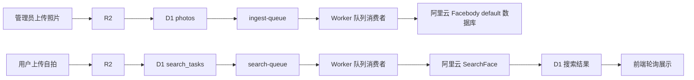

# PhotoFinder / Picture Distributor 项目说明

PhotoFinder 是一个基于 Cloudflare 的活动照片分发系统，主要能力包括：

- 管理员上传照片并按 Class 分组管理
- 使用 Cloudflare Queues 的异步入库与检索链路
- 使用阿里云 Facebody 进行人脸索引与搜索
- 按 Class 控制照片是否可被普通用户检索
- 支持临时访客、Auth Center 绑定、管理员登录
- 支持绑定用户搜索历史
- 支持大图预览、选择下载、ZIP 打包下载

当前线上域名：

- `https://distribute.aryuki.com`

## 1. 项目整体架构

本项目采用“上传 / 检索解耦”的异步架构。



使用到的核心服务：

- Cloudflare Workers：API 网关 + 队列消费者
- Cloudflare D1：元数据、登录态、Class、搜索历史
- Cloudflare R2：原图和自拍存储
- Cloudflare Queues：异步上传处理与异步检索
- 阿里云 Facebody：人脸入库与搜索
- Aryuki Auth Center：管理员登录与用户绑定

## 2. 当前实现中一个非常重要的事实

这个项目里有一个很容易被误解的点，需要明确说明：

- `wrangler.toml` 中仍然保留了 `Vectorize` 绑定。
- 但是当前线上版本 **并没有真正使用 Cloudflare Vectorize 来做人脸相似度检索**。
- 当前生产链路实际使用的是阿里云 Facebody 的 `AddFace` / `SearchFace`。

也就是说当前真实情况是：

- 人脸索引实际存放在阿里云 Facebody 的 `default` 数据库中
- D1 中的 `photos.vector_id` 实际保存的是阿里云 `EntityId`
- 检索时由阿里云返回候选 `EntityId`，再回查 D1 获取照片信息

因此目前系统的搜索主链路是：

1. R2 保存图片
2. 阿里云 Facebody 建立人脸索引
3. D1 保存阿里云 `EntityId`
4. 搜索时阿里云返回匹配实体，再由 D1 查回照片

如果未来要继续演进，这里建议二选一：

1. 彻底切到 Vectorize，并移除阿里云搜索依赖
2. 保持阿里云为主，并明确把 Vectorize 标记为保留但未启用

## 3. 主要业务流程

### 3.1 管理员流程

管理员可以：

- 通过 Aryuki Auth Center 登录
- 创建 Class
- 开放 / 关闭某个 Class 的查询权限
- 向某个 Class 批量上传照片
- 在右下角看到上传状态浮窗
- 查看 Class 中的缩略图
- 删除单张图片
- 删除整个 Class
- 重试失败的入库任务

### 3.2 普通用户 / 临时用户流程

普通用户可以：

- 以临时用户身份进入系统
- 上传自拍或手机拍摄自拍
- 发起异步人脸搜索
- 轮询搜索结果
- 查看原图大图
- 勾选结果照片
- 直接下载原图
- 打包下载 ZIP

### 3.3 绑定用户 / 管理员历史记录

已绑定 Aryuki Auth Center 的用户，以及管理员，可以：

- 打开 History 面板
- 查看某次搜索发生的时间
- 查看当时使用的自拍
- 查看匹配到的照片
- 直接下载该次历史搜索的结果

临时用户在绑定之前不能访问历史记录。

## 4. 仓库结构

当前核心文件：

- [wrangler.toml](/D:/Code/picture-distributor/wrangler.toml)：Cloudflare Worker 配置
- [schema.sql](/D:/Code/picture-distributor/schema.sql)：D1 初始建表脚本
- [migrate-auth-classes.sql](/D:/Code/picture-distributor/migrate-auth-classes.sql)：早期 Class / Auth 迁移
- [migrate-search-history.sql](/D:/Code/picture-distributor/migrate-search-history.sql)：搜索历史迁移
- [worker/index.js](/D:/Code/picture-distributor/worker/index.js)：API 路由与队列消费者
- [worker/homepage3.js](/D:/Code/picture-distributor/worker/homepage3.js)：当前前端页面
- [.gitignore](/D:/Code/picture-distributor/.gitignore)：Git 忽略规则

当前线上实际使用的是：

- `worker/index.js`
- `worker/homepage3.js`

以下文件存在，但当前不作为主入口使用：

- `App.tsx`
- `api-worker.js`
- `consumer-worker.js`
- `worker/homepage2.js`

## 5. Cloudflare 资源配置

### 5.1 Worker

- Worker 名称：`picture-distributor`
- 主入口：`worker/index.js`
- 自定义域：`distribute.aryuki.com`

### 5.2 D1

- 数据库名：`picture-distributor-db`
- 数据库 ID：`b54a3c30-327e-4e07-81bb-303caf1dff7f`

### 5.3 R2

- Bucket 名：`picture-distributor-save`

### 5.4 Queues

- `ingest-queue`
- `search-queue`

### 5.5 Vectorize

- 索引名：`picture-distributor-vector`
- 绑定名：`PHOTO_VECTOR_INDEX`

再次强调：当前生产检索并不依赖 Vectorize。

## 6. 环境变量说明

当前 [wrangler.toml](/D:/Code/picture-distributor/wrangler.toml) 中的主要变量如下：

| 变量名 | 作用 |
|---|---|
| `PUBLIC_APP_ORIGIN` | 公开访问域名 |
| `PUBLIC_R2_BASE_URL` | 预留的公开资源前缀 |
| `APP_ID` | Auth Center 子应用 ID |
| `AUTH_CENTER_ORIGIN` | Aryuki Auth Center 域名 |
| `ADMIN_USERNAMES` | 允许管理员登录的用户名列表 |
| `VECTOR_DIMENSIONS` | 预留的 Vectorize 维度设置 |
| `VECTOR_TOP_K` | 预留的 Vectorize 检索数量 |
| `VECTOR_MATCH_THRESHOLD` | 预留的 Vectorize 阈值 |
| `ALIBABA_ENDPOINT` | 阿里云 Facebody 接口地址 |
| `ALIBABA_REGION_ID` | 阿里云区域 |
| `ALIBABA_DB_NAME` | Facebody 数据库名，目前是 `default` |
| `ALIBABA_API_VERSION` | 阿里云 API 版本 |
| `ALIBABA_SEARCH_LIMIT` | 阿里云最大返回候选数 |
| `ALIBABA_SCORE_THRESHOLD` | 最低 Score 阈值 |
| `ALIBABA_CONFIDENCE_THRESHOLD` | 最低 Confidence 阈值 |
| `ALIBABA_MAX_FACES` | 自拍中最多处理几张脸 |
| `ALIBABA_QUALITY_SCORE_THRESHOLD` | 自拍图像质量阈值 |

阿里云密钥通过 Cloudflare Secret 注入，不写在代码里：

- `ALIBABA_ACCESS_KEY_ID`
- `ALIBABA_ACCESS_KEY_SECRET`

## 7. 数据表说明

### 7.1 `photos`

用于存储活动照片元数据。

关键字段：

- `id`
- `class_id`
- `r2_key`
- `original_name`
- `content_type`
- `size_bytes`
- `status`
- `vector_id`
- `indexed_at`
- `error_message`

其中：

- `vector_id` 当前实际上是阿里云的 `EntityId`

### 7.2 `photo_classes`

用于存储照片分组信息。

关键字段：

- `id`
- `name`
- `is_open`
- `created_by`

说明：

- `is_open = 1` 时，该 Class 可被普通用户检索
- `is_open = 0` 时，该 Class 对普通用户隐藏

### 7.3 `search_tasks`

用于记录自拍搜索任务和历史结果。

关键字段：

- `id`
- `user_id`
- `selfie_key`
- `selfie_name`
- `selfie_content_type`
- `selfie_size_bytes`
- `status`
- `match_count`
- `matched_photo_ids`
- `matched_urls`
- `error_message`
- `completed_at`

### 7.4 `app_users`

用于记录本地应用用户。

`kind` 可能为：

- `admin`
- `auth`
- `temp`

`role` 可能为：

- `admin`
- `user`

### 7.5 `app_sessions`

用于保存 Worker 侧登录会话。

## 8. API 一览

### 登录 / 身份相关

- `GET /api/me`
- `GET /api/auth/login-url?mode=admin|bind`
- `POST /api/auth/temp`
- `POST /api/logout`
- `GET /sso-callback/admin`
- `GET /sso-callback/bind`

### Class 相关

- `GET /api/classes`
- `POST /api/classes`
- `PATCH /api/classes/:id`
- `DELETE /api/classes/:id`
- `GET /api/classes/:id/photos`

### 照片相关

- `POST /api/admin/photos`
- `DELETE /api/photos/:id`
- `GET /api/photos/:id/file`

### 搜索相关

- `POST /api/search`
- `GET /api/status/:taskId`
- `GET /api/history`

### 资源相关

- `GET /api/assets/:encodedKey`

## 9. 照片入库流程

管理员上传图片后，流程如下：

1. 图片先写入 R2
2. Worker 往 D1 的 `photos` 表插入记录，状态为 `uploaded`
3. Worker 往 `ingest-queue` 发送消息
4. 队列消费者从 R2 取图
5. Worker 使用阿里云 STS，把图片上传到阿里云临时 OSS
6. 调用 `AddFaceEntity`
7. 调用 `AddFace`
8. D1 中该照片状态更新为 `indexed`，并写入 `vector_id`

如果失败：

- `photos.status` 会变成 `failed`
- `photos.error_message` 会保存失败原因

## 10. 自拍搜索流程

用户上传自拍后，流程如下：

1. 自拍写入 R2
2. Worker 创建 `search_tasks` 记录
3. Worker 往 `search-queue` 发送消息
4. 队列消费者把自拍上传到阿里云临时 OSS
5. 调用 `SearchFace`
6. 对返回结果做过滤：
   - `Score` 阈值
   - `Confidence` 阈值
   - `MaxFaceNum`
   - `QualityScoreThreshold`
7. 将阿里云返回的 `EntityId` 映射回 D1 的 `photos.vector_id`
8. 普通用户只会拿到“开放 Class”中的照片
9. 结果写回 `search_tasks`

## 11. 前端行为说明

当前前端由 Worker 直接输出 HTML + CSS + JS。

主要行为：

- 默认打开登录页
- 非管理员不会显示管理面板
- 登录后均可使用搜索功能
- 临时用户可后续绑定 Auth Center
- 缩略图优先走 Cloudflare `/cdn-cgi/image`
- 如果缩略图生成失败，会自动回退到原图地址
- 大图预览永远使用原图
- 大图左右箭头采用 SVG 圆角图标
- 上传浮窗会显示：
  - 当前文件名
  - 当前阶段
  - 上传进度条
  - 已完成 / 总数 / 剩余

## 12. 登录与权限模型

### 管理员登录

管理员通过 Aryuki Auth Center 登录。

只有命中 `ADMIN_USERNAMES` 的用户，才允许进入管理员模式。

### 临时用户登录

普通用户可以先以临时身份进入：

- 自动生成正常的英文姓名
- 本地会话登录
- 默认没有历史记录权限

### 绑定 Auth Center

临时用户可后续绑定 Aryuki Auth Center。

绑定后：

- `auth_uuid` 会存入 D1
- 用户可以访问搜索历史
- 菜单中会显示前往用户中心的入口

## 13. 删除行为说明

### 删除单张照片

删除照片时会：

1. 删除阿里云中的对应人脸实体
2. 删除 R2 中的原图对象
3. 删除 D1 中的照片记录

### 删除整个 Class

删除 Class 时会：

1. 找出该 Class 下所有照片
2. 删除每张照片在阿里云中的实体
3. 删除每张照片在 R2 中的对象
4. 删除每张照片在 D1 中的记录
5. 最后删除 `photo_classes` 中的 Class 记录

前端删除前都带确认弹窗。

## 14. 搜索历史

History 功能是有权限控制的。

只有以下两类用户可以访问：

- 已绑定 Auth Center 的普通用户
- 已绑定 Auth Center 的管理员

历史记录包括：

- 当时使用的自拍缩略图
- 自拍原始文件名
- 搜索时间
- 搜索状态
- 匹配到的照片
- 直接下载
- ZIP 下载

## 15. 缩略图策略

前端缩略图使用：

- `/cdn-cgi/image/.../<absolute-url>`

来提升列表页加载速度。

但考虑到边缘缩放可能对某些源图失败，当前实现中每张缩略图都带有：

- `onerror` 自动回退原图

这样可以保证：

- 能生成缩略图时优先走缩略图
- 生成失败时页面至少仍然能显示图片

## 16. 部署方式

当前部署命令：

```bash
npx wrangler deploy
```

推荐的 D1 建表 / 迁移命令：

```bash
npx wrangler d1 execute picture-distributor-db --remote --file=schema.sql
npx wrangler d1 execute picture-distributor-db --remote --file=migrate-auth-classes.sql
npx wrangler d1 execute picture-distributor-db --remote --file=migrate-search-history.sql
```

注意：

如果数据库已经部分迁移过，再重复执行旧迁移，可能出现“重复列”错误。此时建议：

- 先检查当前表结构
- 或者单独写新的幂等迁移脚本

## 17. 当前已知注意点

### 17.1 Vectorize 绑定仍在，但未启用

当前代码仍然带有 `PHOTO_VECTOR_INDEX`，但生产检索主链路没有使用它。

### 17.2 前端是内联 HTML

当前 UI 全部写在 `worker/homepage3.js` 中。

优点：

- 部署简单
- 不需要额外前端构建产物

缺点：

- 文件很长
- 样式、结构、逻辑耦合较高
- 后续做更大规模 UI 改版时不够优雅

### 17.3 阿里云图片约束

部分图片可能因为以下原因无法入库：

- 分辨率过大
- 质量不达标
- 内容不满足人脸检测要求

错误会写入 `photos.error_message`。

### 17.4 缩略图依赖边缘能力

当 `/cdn-cgi/image` 无法生成缩略图时，系统会自动回退原图显示。

## 18. 建议的下一步优化

如果后续继续重构，优先级最高的方向如下：

1. 把前端从 Worker 内联 HTML 拆到独立 React / Next 应用
2. 决定是否真正接入 Vectorize，或者彻底移除它
3. 为照片生成专门的 R2 缩略图对象，而不是只依赖边缘缩放
4. 为大 Class 增加分页或懒加载
5. 为历史自拍增加定期清理机制
6. 增加管理员行为审计日志

## 19. 快速接手清单

建议接手此项目时按下面顺序检查：

1. 配置 Cloudflare Secrets
2. 确认 `wrangler.toml` 中的 D1 / R2 / Queue / 路由绑定
3. 执行 D1 建表和迁移
4. 运行 `npx wrangler deploy`
5. 验证：
   - 临时登录
   - 管理员登录
   - Class 创建
   - 照片上传
   - 入库成功
   - 自拍搜索
   - 绑定用户历史记录
   - 删除图片和删除 Class

## 20. 项目归属说明

这个仓库已经是面向 Aryuki / PhotoFinder 线上环境定制的版本，里面包含：

- 固定的域名
- 固定的 D1 / R2 / Queue 绑定
- 固定的 Auth Center 假设

因此它更接近“部署中的业务工程”，而不是一个完全通用的模板项目。
