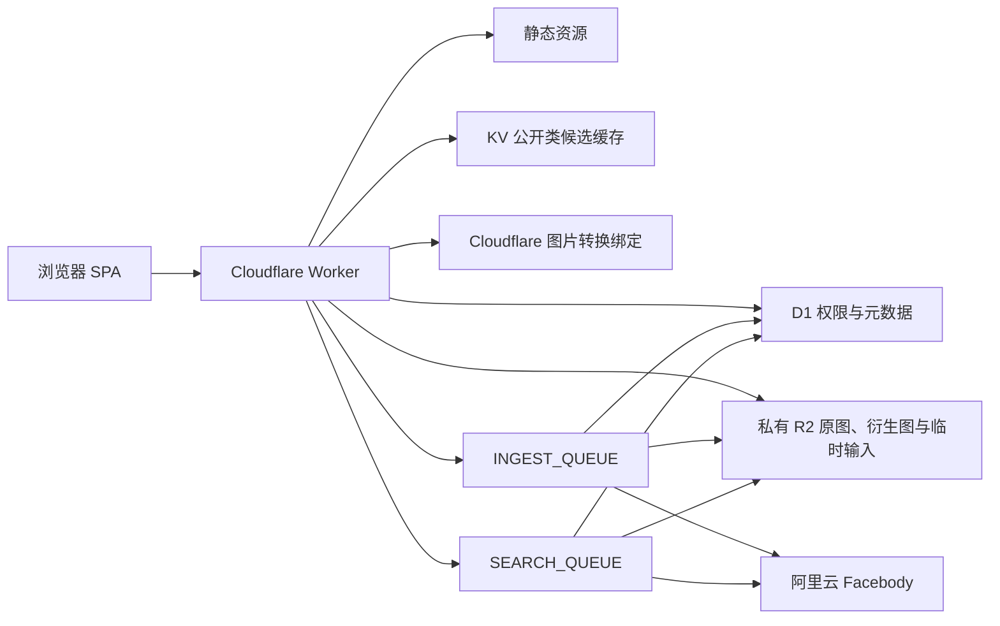

# Aryuki Photo

[English README](README.md)

Aryuki Photo 是一个面向活动摄影、按类分发图片、通过人脸查找本人图片的
Cloudflare 原生应用。项目包含 Google 风格类搜索、阿里云 Facebody 人脸匹配、
基于指针的「另存到自己」、按角色配置的存储空间、限时分享链接、个人主页背景，
以及管理员控制台。

生产地址：`https://distribute.aryuki.com`

本文只把仓库中已经实现的功能写成「当前能力」，其中包括 Queue 生成的
`originals / previews / thumbnails` 三层图片以及管理员上传用量记录。

## 产品原则

- 业务中的 `class` 在全部中文界面和文档中统一称为「类」。
- D1 是身份、权限、可见性、上传者、空间用量、另存指针、分享和任务状态的
  唯一真相来源。
- 每张原图只保存一次；另存和分享只增加引用，不复制原图。
- 所有受保护图片都必须先由 Worker 根据 D1 鉴权，再读取 R2。
- 人脸索引、人脸搜索、图片衍生处理、另存、删除和旧对象搬迁使用 Queue，
  能够安全重试。
- 用户、角色、权限和空间用量始终绑定 Auth Center 稳定 UUID，不绑定
  显示名或用户名，避免重名导致错配。
- 电脑端和手机端共用一套设计系统，并分别适配导航、图片网格、弹窗、摄像头
  和管理员页面。

## 页面与路由

| 路由 | 内容 |
|---|---|
| `/home` | Google 风格 Aryuki 首页、公开类搜索、相机入口、历史、语言、主题和账户入口 |
| `/search?q=...` | 按相关度显示公开类；支持展开图片、选择、另存、预览和下载 |
| `/selfie-recognition` | 电脑摄像头或手机前置相机上传、排队识别、结果、另存和下载 |
| `/history` | 按时间倒序合并显示类搜索记录与自拍识别记录 |
| `/save/` | 本人拥有的类、空间用量、类管理，以及按类归组的 Saved Photos |
| `/share-link` | 新建、查看、修改、复制、停用和删除分享链接 |
| `/s/:slug` | 可设置起止时间和密码的公共分享页 |
| `/account` | 身份、Auth Center 绑定、主题、个人背景和 Bing 每日背景 |
| `/admin` | 管理概览 |
| `/admin/classes` | 所有类、上传者、张数、大小、公开状态、图片展开和强制删除 |
| `/admin/uploads` | 按用户查看上传用量、按天筛选、处理状态、文件大小和 Images 处理开关；每个用户卡片的四项数据与查看按钮保持同一横排 |
| `/admin/users` | 用户、稳定身份、角色对应、实际权限和空间用量 |
| `/admin/roles` | 角色增删改、默认角色、权限模式和空间上限 |
| `/admin/audit` | 按用户归组的行动记录、对象、UUID、可选 IP、国家码、敏感标记和原页照片预览 |

访问 `/` 会跳转到 `/home`。静态资源启用了 SPA 回退，直接打开任一前端路由
也能正常加载。

## 功能总览

### 首页与类搜索

- 首页采用公开 Google 首页的布局和交互作为参考，使用 Aryuki 自己的彩色标识。
- 搜索栏只能直接发现 `public` 类。
- 搜索记录展开后，点击搜索栏和记录框以外区域会关闭记录框。
- 提交搜索时，Aryuki 标识和搜索栏平滑移动到紧凑结果顶栏；向下浏览结果时
  只保留顶栏。
- 搜索、存储、历史和识别结果网格读取缩略图。大图窗口也先显示缩略图；点击
  「查看原图」时只把图片区域升级为预览图，下载时才读取原图。

支持的搜索语法：

```text
"毕业典礼"           完整短语
-草稿                排除词
高一 OR 高二         任意一组满足即可
class:摄影           指定类名称关键词
name:"Class 2026"    指定类名称短语
before:2026-07-01    创建时间早于该日期
after:2026-01-01     创建时间不早于该日期
```

输入最多 160 个字符，先做 Unicode NFKC 规范化，再按完全匹配、前缀、子串、
完整词和词前缀排序。`name:` 与 `class:` 含义相同，因为目前唯一可搜索字段是
类名称。

### 人脸查找

- 电脑端使用 `getUserMedia`，优先请求前置摄像头。
- 手机端保留 `capture="user"` 的前置相机文件入口。
- 已移除原来的上下扫描线和椭圆轮廓。
- 自拍上传后写入 `search_tasks`，再发送到 `SEARCH_QUEUE`；服务端接受任务后，
  用户可以离开页面。
- Queue 从阿里云 Facebody 的实体 ID 找回 D1 图片，再根据当前权限重新过滤。
- 页面不把不可靠的匹配值包装成对用户有保证的「准确度」。
- 自拍识别和类搜索记录显示在同一个历史列表中，用标签区分，按时间倒序排列；
  点击查看后向下展开缩略图。

### 图片网格与悬浮窗口

- 缩略图下方不显示文件名。
- 点击缩略图后在当前页面打开共用的全屏大图窗口，不发生页面跳转；窗口先显示
  缩略图，按需加载预览图，原图仅用于下载。
- 能读取到元数据时，大图窗口显示图片大小、尺寸、相机、拍摄时间、曝光时间、
  光圈、ISO 和焦距；无元数据时至少显示大小。
- 一次下载或另存超过 5 张图片时需要二次确认，但不使用红色警告。
- 任何删除操作都需要红色二次确认。
- 分享持续时间或图片量存在风险时使用红色警告。
- 悬浮窗口打开时锁定底层页面滚动。电脑端居中；手机端确认框贴底向上出现，
  且关闭按钮始终位于可操作区域。
- 上传进度显示在右下角，可以通过向下箭头收起为悬浮圆形按钮。

### 中英文、明暗主题与主页背景

- `public/i18n.js` 支持中文和英文。
- 语言与主题按钮固定在共享顶栏中。
- 浅色、暗色模式都针对自定义图片背景调整了可见性。
- 背景设置属于每个用户，管理入口位于 `/account`。
- 自定义背景保留原图和一张 16:9 裁切图。
- 删除自定义背景后有 30 分钟可恢复时间。
- Bing 模式通过 `https://www.bing.com/HPImageArchive.aspx` 代理当天主页图片，
  不把 Bing 图片保存到 R2。
- 背景覆盖顶栏、主体和底部；已移除原先对整张自定义/Bing 背景的模糊。

## 系统架构



### 各组件职责

| 组件 | 职责 |
|---|---|
| 浏览器 SPA | 前端路由、中英文界面、摄像/文件选择、图片选择、进度、弹窗和任务轮询 |
| Worker 请求入口 | 会话、鉴权、API、R2 输出、静态安全响应头和发送 Queue |
| Worker Queue 入口 | 人脸录入/搜索、预览图/缩略图生成、另存指针、审计写入、删除、上传者转移和旧对象搬迁 |
| D1 | 所有持久元数据和权限状态 |
| R2 | 原图、生成后的预览图/缩略图、临时自拍和个人背景文件 |
| KV | 公开类候选 ID、名称和创建时间的 5 分钟缓存 |
| Images 绑定 | 由 Queue 生成 WebP 预览图和缩略图 |
| 阿里云 Facebody | 人脸实体索引与搜索 |
| Cron | 每 5 分钟恢复任务、重新排队和清理过期数据 |

项目没有绑定 Cloudflare Vectorize。兼容字段 `photos.vector_id` 保存阿里云
Facebody 实体 ID。

## 身份与会话

Aryuki Auth Center 是外部身份来源。Worker 验证回传 token 后，只保存稳定身份
字段和本应用自己的不透明会话：

- `auth_uuid` 是唯一、稳定的身份主键。
- `auth_user_id`、`username`、显示名 `name`、邮箱和头像属于可在登录时刷新的
  资料。
- 页面主要显示 `username`，显示名或邮箱作为辅助信息。
- 只有 Auth Center 回传邮箱时，`/account` 才显示邮箱已绑定信息。
- 非管理员的用户菜单提供
  `https://accounts.aryuki.com/<auth_uuid>` 个人详情入口。
- 不在 D1 保存 Auth Center bearer token。
- 普通应用会话有效 14 天。
- 经过验证且明确属于 `picture-distributor` 的测试会话有效 30 分钟。
- 除已验证的定向测试回调外，登录回调必须通过 state 校验。

临时用户会获得本地会话，可以使用公开搜索、自拍识别和历史。上传、另存、分享
和背景管理需要绑定 Auth Center。临时用户绑定后，原有历史会迁入稳定账号。

管理员身份与可配置角色分开：

- `ADMIN_AUTH_UUIDS` 保存用逗号分隔、已经核验的 Auth Center UUID。
- 数据库中已有管理员以同一个稳定 UUID 登录时仍保持管理员身份。
- 用户名和显示名不能授予管理员权限。

## 角色、权限与空间

系统始终只有一个默认角色，新绑定用户会自动获得它。

| 权限模式 | 可读范围 | 可写范围 | 空间信息 |
|---|---|---|---|
| `all_read` | 所有类 | 不可写 | 显示 |
| `all_write` | 所有类 | 可创建和修改任何类/图片 | 显示 |
| `own_write` | 公开、本人拥有、本人另存的内容 | 可创建类；可修改本人类/图片 | 显示 |
| `own_read` | 公开和本人另存的内容 | 不可写；可以另存有权读取的内容 | 隐藏 |

管理员会得到实际 `all_write` 权限，并额外拥有用户、角色、审计、对象搬迁和
强制删除入口。

空间使用十进制 GB：

```text
1 GB = 1,000,000,000 bytes
```

- `roles.quota_bytes` 是角色空间上限。
- `app_users.storage_used_bytes` 是当前计费用量。
- 上限为 `0` 表示不限量。
- 新 SHA-256 资产按实际保存的原图、预览图和缩略图总字节计入物理所有者；旧记录
  在专门迁移前继续沿用旧计费方式。
- 另存指针、分享引用、自拍输入和 Bing 背景不会作为重复原图计费。
- 上传前在 D1 原子预留空间；超过当前角色上限时，不会继续提交存储。
- 为避免别人另存的内容消失，上传者转移允许接管者暂时超过上限；在释放空间
  或管理员提高角色上限之前，新的上传会继续被拒绝。

## 类、图片与公开状态

`photo_classes` 是类模型；正常状态下，每张 `photos` 图片属于一个类。

- `public`：可通过首页类名称搜索发现，也能从公开结果读取。
- `private`：不会进入公开搜索，但管理员、`all_read`/`all_write` 用户、上传者、
  另存者以及持有有效分享链接的访问者仍可按权限读取。
- 迁移兼容期保留 `is_open`：`1` 对应 `public`，`0` 对应 `private`；当前写入
  会同步更新两个字段。
- 修改类公开状态时只更新 SPA 局部状态，不刷新整个页面。

单次请求最多上传 100 张图片。普通图片每张最大 25 MiB，Apple ProRAW DNG 每张
最大 90 MiB。Worker 根据文件字节签名验证，不信任文件名或浏览器声明的类型。
支持 JPEG、PNG、WebP、GIF、AVIF、HEIC、HEIF 和 Apple ProRAW DNG；拒绝可执行
的 SVG。DNG 必须包含 Apple 相机写入、可直接显示的 JPEG 预览图。

`photos.original_name` 和上传记录使用浏览器提供的 `File.name`。通常它就是设备
相册选择器暴露的存储文件名；若浏览器出于隐私原因替换或临时生成了名称，网页
无法再读取相册内部未提供的另一个名称。

元数据读取范围限制在文件头 512 KiB：

- JPEG：尺寸与部分 EXIF；
- PNG、GIF：尺寸；
- 扩展 WebP：尺寸。

## ID、内容 ID 与 R2 目录

新 ID 使用小写类型前缀，加上由 12 个加密安全随机字节生成的 16 位 base64url
主体：

```text
c_xdPr4EyB1q6YzZk9
p_e2P5CHFMf7pPM2y_
```

随机主体为 96 bit。常见前缀包括 `u_`、`c_`、`p_`、`task_`、`hist_`、
`bg_`、`save_`、`link_`、`role_`、`job_`、`audit_`、`up_`、`ses_`。
`c_past000000000000` 是唯一一个旧数据迁移固定 ID 例外。

应用 migration `0008` 后接受的每次上传都使用固定内容 ID：对未经修改的原图完整
字节计算 SHA-256，得到 64 位小写十六进制结果。三个文件名共用同一个内容 ID：

```text
p_or_<内容-id>.<规范扩展名>
p_pr_<内容-id>.webp
p_th_<内容-id>.webp
```

新图片使用以下私有 R2 key：

```text
originals/<类-id>/p_or_<内容-id>.<规范扩展名>
previews/<类-id>/p_pr_<内容-id>.webp
thumbnails/<类-id>/p_th_<内容-id>.webp
temp/selfies/<任务-id>.<规范扩展名>
backgrounds/<用户-id>/<背景-id>-original.<扩展名>
backgrounds/<用户-id>/<背景-id>-cropped.<扩展名>
```

新图片的物理对象 key 以 `photo_assets` 为准；历史图片继续以 `photos.r2_key`
为准。旧对象保留原路径和文件名，migration `0008` 不会重命名或移动它们。
SHA-256 只用于内容身份和去重，不能替代任何权限判断。

某个 SHA-256 内容第一次上传时，仍按原有目录规则把三个对象放在第一个类 ID
下面。之后向其他类上传字节完全相同的图片时，会在目标类创建新的逻辑 `photos`
记录，但复用同一条 `photo_assets`。所以图片仍分别显示在 My Classes 和
All/Managed Classes 中，R2 实体却继续留在第一个类的文件夹。所有图片读取都先
对逻辑图片、类和分享进行鉴权，之后才解析实体 key。

## 三层图片处理与加载

以下是本仓库目前已经实现的行为：

1. 上传请求先验证图片，对完整原始字节计算 SHA-256，并原子声明或复用
   `photo_assets`。
2. 不论 Images 处理是否开启，都写入一条 `photo_upload_records`，记录上传者
   快照、原文件名、上传后文件名、三个 key、原图/整体大小、时间和状态。
   即使关闭 Images 处理，原图仍统一命名为 `p_or_<sha256>.<扩展名>`。
3. 开启 Images 处理后，发送 `photo.variants` 到 `INGEST_QUEUE`。消费者生成
   宽 1600、质量 84 的 WebP 预览图，以及宽 520、质量 74 的 WebP 缩略图。
   ProRAW 原始 DNG 保持不变，衍生图与人脸录入使用其中内嵌的 JPEG 预览。
4. Images 状态为 `queued`、`processing`、`completed`、`decline`、`error`。
   关闭处理时新上传写 `decline`；转换异常写 `error`。
   人脸识别另有独立状态和错误详情；后台明确显示 `Images error` 或
   `Facial recognition error`。
5. `/api/photos/:id/thumbnail` 和 `/api/photos/:id/preview` 必须先判断本次
   请求权限，之后才查内部 Edge Cache；对浏览器始终返回 `private, no-store`。
6. Edge Cache 只保存衍生图字节，不保存用户或会话的权限结论。即使已命中缓存，
   权限或公开状态发生变化后也不能绕过新的鉴权。
7. 衍生图不存在时，ProRAW 回退到其内嵌 JPEG，其他格式回退到已鉴权的原图。
   `/api/photos/:id/file` 始终输出未经修改的原图，并支持字节范围。
8. 公共分享缩略图也会重新检查链接有效期、密码会话、分享所有者和已选内容，
   然后才走同一条私有衍生图读取路径。
9. 重复上传记录显示 `deduplicated`，`occupied_bytes=0`，并简要注明未增加存储；
   审计仍保留该图片的原图大小和整体大小。
10. 物理删除会同时删除原图、预览图和缩略图。只发生接管时保留三个文件，
   因为底层图片仍有效。

已有图片只补写一条 `decline` 上传记录，不移动旧 R2 对象，也不声称完成过
转换；读取时继续回退到已鉴权的原图。以后可以用有上限的 Queue 任务回填衍生图，
但不能改变任何查看、增删、另存或分享权限。

新 SHA-256 资产的原图和生成后的衍生图都计入物理所有者的角色空间和
`storage_used_bytes`；重复逻辑图片不增加用量。

### 图片上传去重与「另存到自己」是两条链路

两条链路必须分开理解和实现：

- 上传去重会在目标类创建另一张逻辑图片，只复用底层实体；
- 「另存到自己」只创建 `saved_classes` 或 `saved_photos` 个人库指针，不创建
  新的上传图片；
- 去重资产的接管顺序看上传记录，另存内容的保留顺序看另存指针，两个表不能
  互相代替。

物理源图片被普通删除、但仍有其他逻辑上传引用时，最早的有效上传记录成为新的
物理所有者。其标签由 `deduplicated` 改为 `completed`，`occupied_bytes` 改为
资产总大小，旧所有者释放用量；R2 key 保持不变。管理员强制删除是明确例外：
它忽略两条链路，删除实体和所有逻辑引用。

## 「另存到自己」与删除规则

`saved_classes`、`saved_photos` 都指向唯一原图。创建另存会发送
`pointer.save`，接口返回 HTTP `202`。

必须满足以下规则：

1. 另存不复制 R2 对象，也不增加计费用量。
2. 非上传者删除时，只删除自己的指针。
3. 上传者普通删除时，目标先被软隐藏，并创建唯一、幂等的 `deletion_jobs`。
4. Queue 消费者重新读取任务，并核对 `expected_owner_user_id`。
5. 存在有效指针时，按 `(created_at, user_id)` 选择最早指针成为新上传者，
   对应字节也转移给新上传者。
6. 删除类时，若只有单图指针保住某张图片，使用 `class_removed_at` 让它脱离
   原类、搜索和按类分享，但新上传者仍保留独立图片。
7. 没有有效指针时，才删除阿里云实体、R2 对象、D1 行并释放空间。
8. 历史和分享引用不能保留上传者资格。
9. 管理员强制删除忽略指针并直接物理删除。所有读取路径都必须容忍 D1 行或
   R2 对象已经不存在。

任务状态为 `pending -> processing -> completed|failed`。同一个
`(kind, target_id)` 最多只有一个活动任务，因此 Queue 重复投递不会重复扣减
或重复转移。

## 分享链接

分享链接可以同时引用整个类和单张图片，但不会复制图片文件。

- 自定义后缀为 3-64 位小写字母、数字、连字符或下划线。
- 可选开始与结束时间。
- 状态为 `active` 或 `disabled`。
- 最多选择 500 个类和 1,000 张图片。
- 选择整个类时，动态包含其中当前仍可用的图片。
- 图片被删除或脱离原类后，会自动从相应分享中不可见。

密码规则：

- 最少 6 个字符。
- 验证使用随机盐和带服务端密钥的单向哈希。
- 分享所有者查看明文密码时，使用单独保存的加密密文。
- 创建、验证、解密或修改带密码分享都需要 `SHARE_PASSWORD_KEY`。
- 同一网络和分享每 10 分钟最多尝试 5 次密码。
- 分享会话 token 在数据库中只保存哈希，最长有效 12 小时，并且不会超过分享
  结束时间。

## Queue、恢复与保留时间

`INGEST_QUEUE` 处理：

- `photo.ingest`
- `photo.variants`
- `face.delete`
- `storage.delete`
- `storage.rekey`
- `pointer.save`
- `audit.write`

`SEARCH_QUEUE` 处理 `search.run`。

消费者批次大小为 1，Cloudflare 重试 3 次；Worker 还会给失败消息设置指数
退避，并配置独立死信队列。D1 任务行始终是持久状态来源。

每 5 分钟 Cron 会：

- 将卡住超过 15 分钟的图片索引、图片处理、人脸搜索或删除任务恢复为可重试状态；
- 重新发送待处理任务；
- 在完成/失败 24 小时后清理自拍输入，最迟不超过 7 天；
- 临时用户搜索历史保留 7 天；
- 已绑定用户的搜索与自拍历史保留 90 天；
- 清理过期应用会话、分享会话和限流桶；
- 30 分钟恢复期结束后永久删除旧背景文件；
- 临时用户超过 30 天未活动且没有任何关联数据时，清理该用户。

设置 `RETRY_FAILED_JOBS=true` 后，Cron 也会重新发送失败的删除任务。

## 管理员与审计

管理员控制台包含：

- 类、有效类、图片、用户、字节数、有效分享和待处理任务总览；
- 每个类的上传者、张数、大小、公开状态和可展开图片；
- 用户和角色对应、实际空间上限与用量；
- 角色新建、修改、删除、排序和默认角色；
- 按上传者归组的图片上传用量，支持精确到天的范围筛选、整体统计、原图/衍生图/
  实际占用大小、文件名、Images 与人脸识别详细错误，以及 `deduplicated` 接管状态；
  每个上传者卡片把总上传、已处理、已复用、实际占用和查看按钮放在同一响应式横排；
- 仅管理员可操作的 Images 处理开关；关闭时新上传记为 `decline`，处理失败保留
  为 `error`；
- 重新发送失败的人脸索引；
- 可恢复的旧 R2 key 搬迁；
- 强制删除类或图片；
- 按用户归组的审计记录；IP 默认隐藏，由管理员开关显示；仍然有效的照片对象
  在 `/admin/audit` 原页面调用共用全屏大图窗口，不再跳转到文件地址。

可审计请求成功后，记录通过 Queue 写入。每条包含本地用户 ID、Auth Center
UUID、行动名、IP、二字国家码、敏感标记、对象类型/ID/名称/数量和时间。
删除等敏感行为红色显示。手机空间不足时 UUID、IP 和对象名可以折叠，但仍可
复制完整内容。

## D1 数据模型

| 表 | 用途 |
|---|---|
| `roles` | 权限模式、空间上限、默认/系统标记和排序 |
| `app_users` | Auth Center 稳定身份、资料、角色、管理员标记和计费用量 |
| `app_sessions` | 本应用不透明会话 |
| `photo_classes` | 类名称、介绍、上传者、公开状态和删除状态 |
| `photo_assets` | SHA-256 实体身份、不变的对象 key、物理所有者、字节、衍生图和人脸处理状态 |
| `photos` | 逻辑类归属、上传者、可选资产引用、显示元数据、索引和删除状态 |
| `photo_upload_records` | 上传者快照、内容 ID、三个对象 key、整体/实际占用、去重标记、时间及 Images/人脸状态 |
| `image_processing_settings` | 管理员控制的单例 Images 处理开关 |
| `saved_classes` | 用户到类的另存指针 |
| `saved_photos` | 用户到图片的另存指针 |
| `deletion_jobs` | 幂等删除与对象搬迁任务 |
| `search_tasks` | 自拍输入、任务状态、顺序匹配结果和分数 |
| `class_search_history` | 类搜索文字及结果图片引用 |
| `share_links` | 所有者、后缀、有效期、密码材料和状态 |
| `share_link_classes` | 分享到类的引用 |
| `share_link_photos` | 分享到图片的引用 |
| `share_sessions` | 哈希后的临时解锁会话 |
| `user_backgrounds` | 背景模式、原图/裁切图和恢复状态 |
| `audit_logs` | 行动人、网络、行动、敏感标记和处理对象 |
| `rate_limit_buckets` | D1 固定窗口限流计数 |

旧字段 `role`、`is_open`、`size_bytes`、`matched_urls` 等会保留到所有已部署
版本都停止读取为止。

## API 概览

### 身份

```text
GET  /api/me
GET  /api/auth/login-url
POST /api/auth/temp
POST /api/logout
GET  /sso-callback[/<mode>]
```

### 类、图片与搜索

```text
GET|POST          /api/classes
GET|PATCH|DELETE  /api/classes/:id
GET|POST          /api/classes/:id/photos
GET                /api/class-search
GET|POST           /api/class-search-history
POST               /api/search
GET                /api/status/:taskId
GET                /api/history
DELETE             /api/history/:type/:id
GET                /api/selfies/:taskId/file
GET                /api/photos/:id/thumbnail
GET                /api/photos/:id/preview
GET                /api/photos/:id/file
DELETE             /api/photos/:id
```

### 存储、背景与另存

```text
GET         /api/storage
GET         /api/saved
POST|DELETE /api/saved/classes/:id
POST|DELETE /api/saved/photos/:id
GET|POST|DELETE /api/background
POST        /api/background/mode
POST        /api/background/restore
GET         /api/background/file
GET         /api/background/bing
```

### 分享

```text
GET|POST           /api/share-links
GET|PATCH|DELETE   /api/share-links/:id
GET                /api/public/shares/:slug
POST               /api/public/shares/:slug/unlock
GET                /api/public/shares/:slug/photos/:photoId/file
GET                /api/public/shares/:slug/photos/:photoId/preview
GET                /api/public/shares/:slug/photos/:photoId/thumbnail
```

### 管理员

```text
GET          /api/admin/overview
GET          /api/admin/uploads
GET          /api/admin/uploads/records
GET|PATCH    /api/admin/image-processing
GET          /api/admin/classes
GET          /api/admin/users
PATCH        /api/admin/users/:id
GET|POST     /api/admin/roles
PATCH|DELETE /api/admin/roles/:id
GET          /api/admin/audit
POST         /api/admin/retry-ingest
DELETE       /api/admin/classes/:id
DELETE       /api/admin/photos/:id
POST         /api/admin/storage/rekey
GET          /api/admin/storage/rekey/status
```

为旧版本兼容，仍保留 `POST /api/admin/photos` 和 `/api/query-history`。

## 仓库结构

```text
public/
  index.html          SPA 外壳
  app.js              页面路由、渲染和交互
  client.js           API、超时和上传进度
  i18n.js             中英文翻译层
  search-syntax.js    浏览器端搜索语法
  styles.css          设计 token、响应式布局、弹窗和图片网格
worker/
  index.js            请求、API、Queue、Cron、鉴权和存储逻辑
  lib/
    alibaba.js        Facebody 接入
    dng.js            ProRAW/DNG 检测与内嵌 JPEG 提取
    ids.js            96-bit 带类型 ID
    image-metadata.js 安全的文件头和 EXIF 提取
    passwords.js      分享密码哈希与加密
    search-query.js   服务端搜索解析与排序
migrations/           已有数据库的增量升级
schema.sql            全新 D1 的完整结构
design-research/      参考图与视觉检查截图
wrangler.toml         Worker 域名、绑定、Queue 和 Cron
```

`.gitignore` 已排除本地输出、测试目录、Playwright 报告/结果、临时目录、
构建/部署缓存、环境文件、凭据，以及各种 secret 文件和目录。

## Cloudflare 绑定与配置

`wrangler.toml` 定义：

| 绑定 | 服务 |
|---|---|
| `ASSETS` | 静态 SPA |
| `DB` | D1 |
| `PHOTO_BUCKET` | 私有 R2 |
| `SEARCH_CACHE` | 公开类候选 KV 缓存 |
| `IMAGES` | 图片转换 |
| `INGEST_QUEUE` | 索引、删除、另存和审计 Queue |
| `SEARCH_QUEUE` | 人脸搜索 Queue |

配置还包含生产自定义域、每 5 分钟的 Cron，以及两条生产 Queue 各自的死信队列。

非敏感变量包括公开地址、Auth Center 地址和应用 ID、管理员 UUID 白名单、
阿里云端点/区域/人脸库/API 版本及匹配限制。

生产环境必须设置：

```bash
npx wrangler secret put ALIBABA_ACCESS_KEY_ID
npx wrangler secret put ALIBABA_ACCESS_KEY_SECRET
npx wrangler secret put SHARE_PASSWORD_KEY
```

`SHARE_PASSWORD_KEY` 应使用独立、高随机度的值。Auth Center 测试登录 secret、
Cloudflare 凭据、API key、资源导出、`.dev.vars` 和本地 secret 文件都不能
写入源码、前端、日志或文档。

## 本地开发

要求：

- Node.js 22.5 或更高版本；
- npm；
- 需要操作远端资源或部署时，准备 Cloudflare 账号并完成 Wrangler 登录。

安装依赖：

```bash
npm ci
```

仅本地开发时，可以在已忽略的 `.dev.vars` 中写变量名和本地值，但不得提交：

```text
ALIBABA_ACCESS_KEY_ID=...
ALIBABA_ACCESS_KEY_SECRET=...
SHARE_PASSWORD_KEY=...
```

创建本地 D1 并启动：

```bash
npx wrangler d1 execute picture-distributor-db --local --file=schema.sql
npm run dev
```

本地 Cloudflare 状态位于已忽略的 `.wrangler/`。

## 全新数据库与迁移

### 全新数据库

只应用完整 schema：

```bash
npx wrangler d1 execute picture-distributor-db --remote --file=schema.sql
```

全新数据库不要再次执行旧库 migration。

### 已有数据库

执行任何远端写入前，先查看迁移状态并导出备份：

```bash
npx wrangler d1 migrations list picture-distributor-db --remote
npx wrangler d1 export picture-distributor-db --remote --output=backup-before-migration.sql
```

暂停上传，按计划部署兼容代码，再执行增量 migration：

```bash
npx wrangler d1 migrations apply picture-distributor-db --remote
```

迁移记录：

| 文件 | 内容 |
|---|---|
| `0001_product_model.sql` | 角色、空间、上传者、公开状态、另存指针、分享、删除/搬迁任务、匹配分数和索引 |
| `0002_legacy_photos_to_past.sql` | 将没有上传者的旧图片归入私有 `past`，指定最早管理员、重算用量，不修改 R2 key |
| `0003_own_read_backgrounds.sql` | 增加类介绍，以及初始自定义背景/恢复表 |
| `0004_background_share_audit.sql` | 增加背景模式、分享密码加密显示材料和审计表 |
| `0005_photo_metadata_audit_targets_email.sql` | 增加邮箱、图片元数据和审计对象字段 |
| `0006_image_variants_upload_records.sql` | 增加 Images 开关和上传/衍生图用量记录；旧图片只补写 `decline`，不移动对象 |
| `0007_anonymous_local_history.sql` | 未登录历史只保存在浏览器，并允许服务端搜索任务在清理后不再绑定用户 |
| `0008_sha256_photo_assets.sql` | 增加 SHA-256 图片资产、逻辑图片引用、实际占用、去重及独立人脸状态；不修改旧名称和 R2 key |
| `0009_photo_asset_concurrency.sql` | 防止并发的字节相同请求在同一个类中创建两张有效逻辑图片 |

重要升级检查：全新 schema 支持 `own_read`。如果旧数据库最初通过 migration
`0001` 创建，`roles.access_mode` 可能仍只有三个允许值，因为 migration `0003`
并没有重建 `roles` 表。给角色设置 `own_read` 前，必须检查 `sqlite_schema`；
若仍是旧约束，应先编写并评审专门的表重建 migration，不能直接假设已经支持。

旧图片迁移使用固定类 ID `c_past000000000000`，默认设为 `private`，上传者为
最早的管理员，而且不移动 R2 对象。迁空的旧类会软删除并保留审计痕迹。

元数据迁移完成后，管理员可以启动可恢复的对象 key 规范化：

```text
POST /api/admin/storage/rekey
GET  /api/admin/storage/rekey/status
```

每个 `rekey_photo` 任务按「复制到规范 key、更新 D1、再删除旧对象」执行。

## 测试与部署

运行语法检查和本地测试：

```bash
npm run check
```

当前 `node:test` 覆盖：

- 96-bit 带类型 ID；
- 固定的 64 位小写 SHA-256 图片内容 ID 与资产引用；
- 服务端和浏览器搜索语法；
- 英文翻译与动态数量；
- 图片元数据签名；
- 带服务端密钥的分享密码验证和仅所有者可解密；
- 全新 schema 与默认角色；
- 旧图片到 `past` 及上传记录的迁移；
- Wrangler 静态资源、KV、任务恢复、死信队列和无 Vectorize 配置；
- 可选数字参数默认值；
- 图片字节签名、拒绝 SVG；
- Unicode 下载文件名；
- 仅接受经过验证、属于本应用的测试回调。

部署前检查并部署：

```bash
npm run deploy:check
npx wrangler deploy
```

部署后检查：

1. 确认线上静态资源版本和 `/api/me`；
2. 使用新生成、明确属于本应用的 Auth Center 测试登录，不记录 secret；
3. 分别检查电脑/手机、中文/英文、浅色/暗色；
4. 测试公开/私有搜索、人脸识别、历史展开、原图大图、另存 Queue、上传索引
   Queue、分享密码、账户背景、空间上限和管理员审计；
5. 确认页面没有横向滚动，所有悬浮窗口都会锁定底层页面；
6. 查看 Queue 失败情况和两条死信队列。

## 安全与运维不变量

- 所有修改数据的请求必须同源。
- 应用会话、分享解锁 token、背景恢复 token 按各自用途使用 Secure、HttpOnly
  或哈希保存。
- 受保护对象不能通过公开 R2 地址访问。
- 每次受保护读取都要根据 D1 重新判断权限。
- KV 不保存任何权限真相。
- 根据字节签名验证图片，拒绝 SVG 和声明类型不一致的文件。
- 文件响应使用安全的 Unicode `Content-Disposition`、`nosniff`、沙箱 CSP、
  同源资源策略和字节范围。
- 静态响应包含 CSP、禁止嵌入、引用来源、浏览器权限和内容类型保护。
- Queue 消息只携带稳定 ID；进行破坏性操作前，消费者重新读取 D1。
- 空间用量随上传者转移，不随显示名、用户名、另存次数或分享次数变化。
- 真实 secret 不得提交，也不能粘贴到 issue、README、前端、截图或命令记录。

## 视觉参考

`design-research/google-home-2026-07-27.png` 记录了用于研究间距和交互的公开
Google 首页。Aryuki Photo 使用自己的标识、内容、导航和业务行为。

其余 `design-research/qa-*.png` 记录电脑端、手机端、暗黑模式、英文版、搜索
动效、自拍、历史和管理员页面检查结果，只作为视觉检查证据，不是运行依赖。
